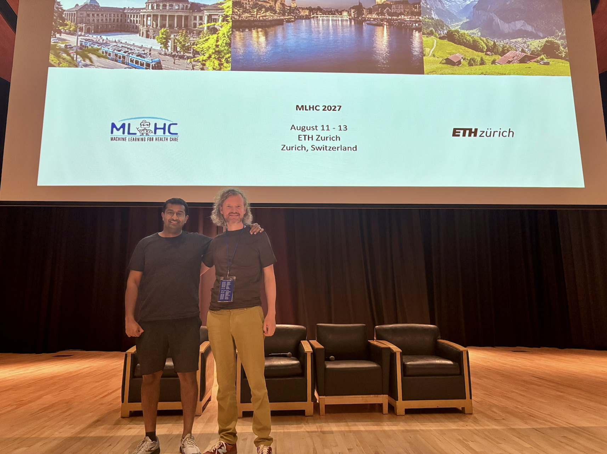
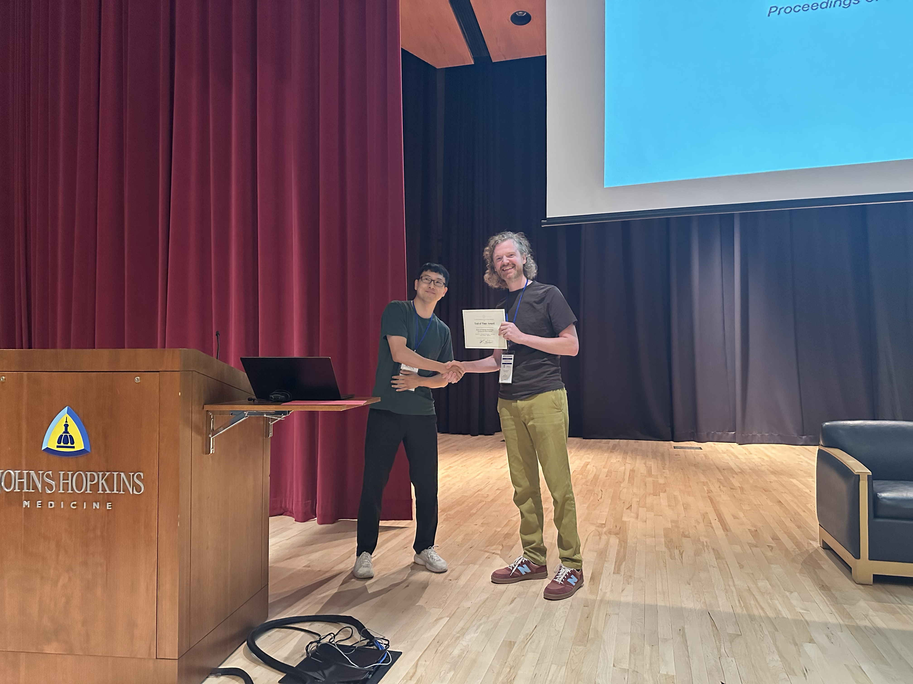
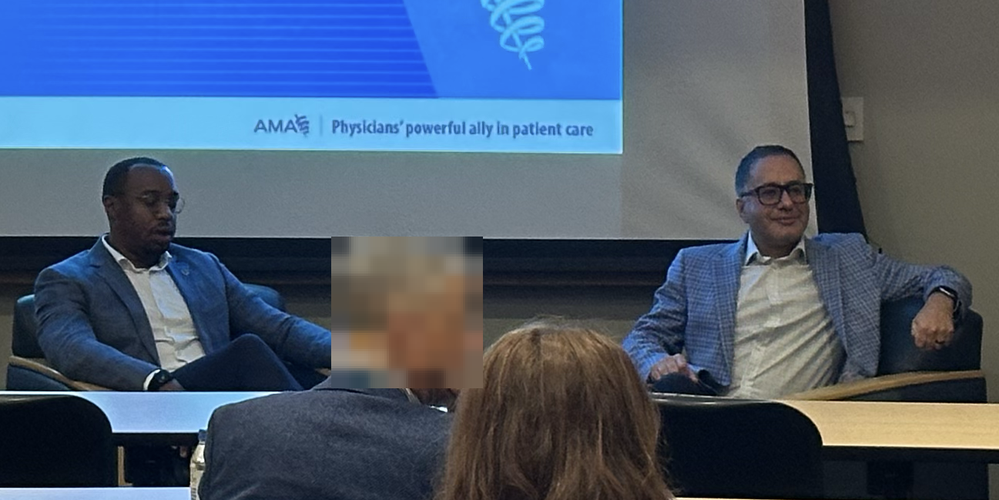
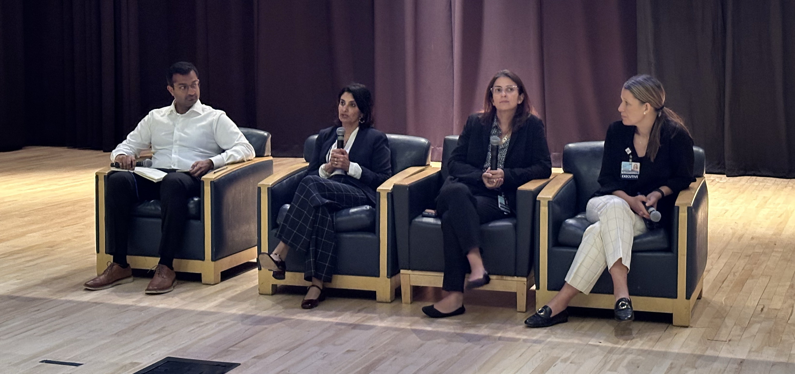

{fig-alt="Machine Learning for Healthcare 2026 at Johns Hopkins University" width="100%"}

The eleventh Machine Learning for Healthcare Conference (MLHC 2026) brought over 250 attendees to Johns Hopkins University for another year of work at the intersection of clinical medicine and machine learning. Now that Rahul Krishnan and I have had a chance to debrief, here are three highlights that we wanted to share with all of you.

## A] *New* this year

We tried three new things: a fireside chat with health system leaders, a test of time award, and a student presentation track.

The research oral talks covered:

- learning prostate anatomy at test time for cancer detection in micro-ultrasound
- interpretable continual learners for non-stationary clinical domains
- sensitivity analysis for survival outcomes
- censoring-aware reinforcement learning for early risk alerts

The abstract orals on the second day covered breast cancer risk prediction from screening ultrasound, kidney tumor classification and fairness evaluation with vision-language models, and multimodal prediction of outcomes after total knee arthroplasty.

The inaugural test of time award went to *Doctor AI: Predicting Clinical Events via Recurrent Neural Networks* (Choi et al., 2016). The paper is prescient in hindsight: it treated the patient record as an event stream and asked what happens when you scale a predictive sequence model over it, roughly a decade before “next token prediction” was the default way to think about such problems. Picking the first recipient forced us as a program committee to think deeply about what "standing the test of time" means in a field this young.

{fig-align="center" width="75%"}

## B] Substitutive vs Additive technology

"AI should augment human intelligence, not replace it." This is the dominant way to talk about AI in healthcare, and it is comfortable for everyone. But it doesn't mean it is right.

This ideology pledges us to think of AI as an *additive* technology, and additive technology has a consistent historical track record of increasing total healthcare spending. Bryan Adibe raised this in a panel with Chris Khoury (AMA) during the pre-conference workshop this year.

We have decades of experience adding technology to medicine: from basic chemistry panels to genomic sequencing, from plain film X-ray to CT and MRI. Each of these improved care but each also raised the cost of an episode of care, because each one added a step performed by a person who had to be paid, and often generated findings that prompted further steps. Health economists have argued for a long time that technology is the principal driver of spending growth in medicine. In many sectors, technology substitutes for labor and pushes costs down. In medicine it has mostly layered on top of labor. Perhaps it is time to rethink what care should even look like from the ground up?

If we want AI to reduce total spending rather than add to it, we need to be transparent that this requires closed-loop deployments, where human oversight is reactive and periodic rather than integral to every individual decision. Without this difficult choice, costs will continue to rise. Indeed the obstacle to substitutive AI is rarely accuracy. It is that nobody has worked out who is liable when such a system is deployed, how such a system gets paid for, and what monitoring regime a regulator will accept in place of having a human in the loop. Those are some of the problems our field needs to begin finding solutions for now.

{fig-align="center" width="75%"}

## C] Epic as the *easy* choice

The chat with Seema Verma (Oracle Health), Sara Murray (Enterprise CMIO & AI Officer at Johns Hopkins Medicine) and Deanna Hanisch (CIO at Johns Hopkins) was a new addition this year and one that participants found broadly useful, not just because of the candid advice shared, but also because it gave folks a chance to reflect on how their work might change clinical care one day.

One of the big ticket questions was how does a CMIO/CIO decide which algorithms to deploy. To a room full of researchers hoping to see their algorithms deployed, the answer was that home-grown algorithms stand little chance. This is disappointing but gave us some valuable insight into how health systems think; from their point of view, the overhead of deployment, monitoring and provenance over years has rarely outweighed the benefit of a similar algorithm already available via Epic.

Furthermore, a successful model is such a small part of clinical care; indeed the highest additions of value largely come from when the algorithms are correctly and carefully embedded into care pathways and workflows. This takes patience, listening, time and care to do correctly.

Innovating in medicine with algorithms is increasingly in the hands of a select few companies. If we want to advance AI in healthcare, the increasing dominance of a single EHR vendor is unlikely to be the right choice for customers. Furthermore if Epic, whose core audience is the US market where healthcare is private, continues to control large market share in countries with mixed public and private systems, it represents a mismatch of objectives. I.e. Epic’s focus on improving tools to improve hospital revenue may deprioritize ways of enabling AI systems that improve clinical outcomes in public systems.

The panel prompted much questioning among what potential solutions could look like? Can regulation break through? Should countries, particularly those with interacting public and private systems, develop an open-source EHR since AI has made software tooling easy to prototype and scale?

{fig-align="center" width="75%"}

## MLHC 2027 at ETH in Zurich

It was a privilege to be general chair for MLHC this year alongside Rahul Krishnan and our great group of program chairs. I am excited that next year we'll bring MLHC outside North America for the first time, to the great city of Zurich, August 11-3 2027. I hope to meet many of you there!
