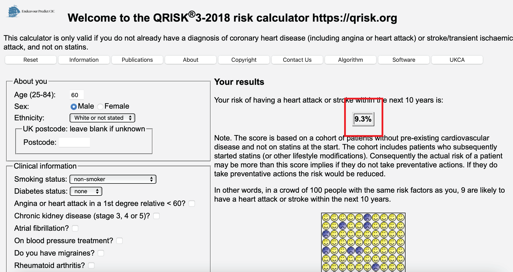
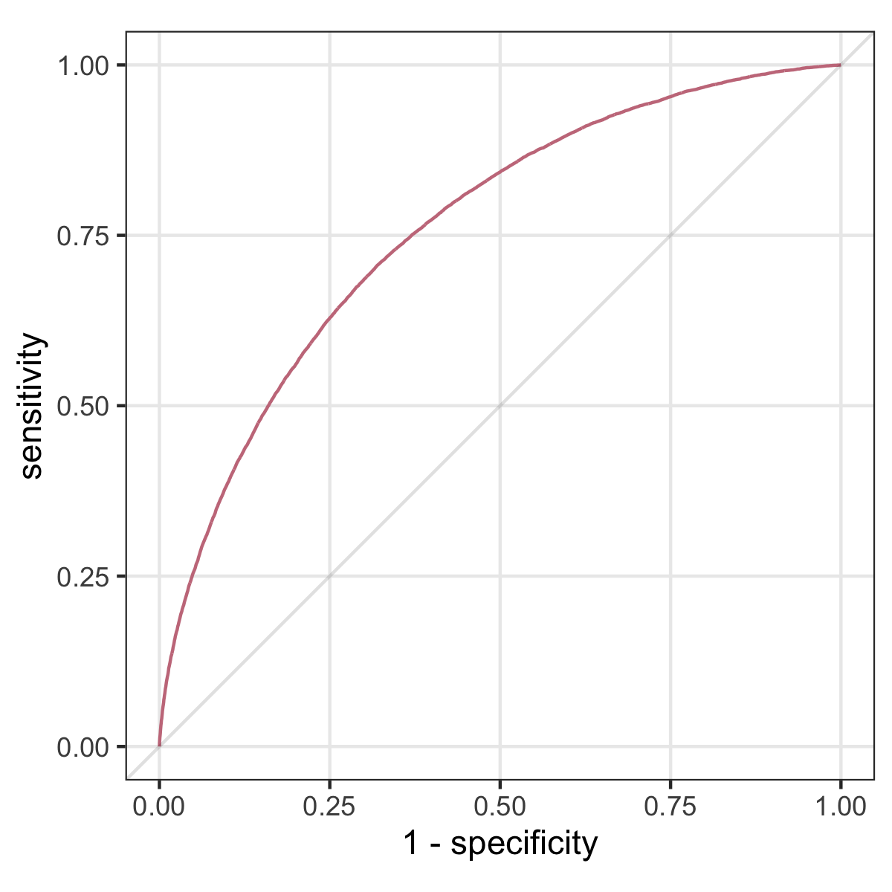
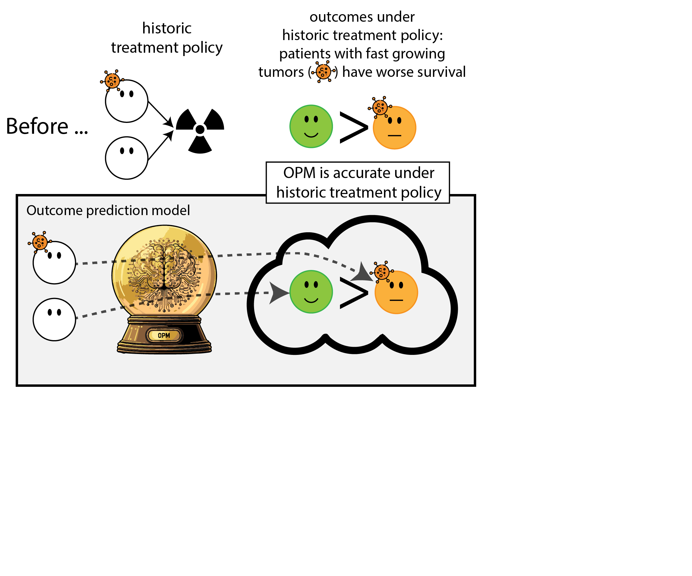
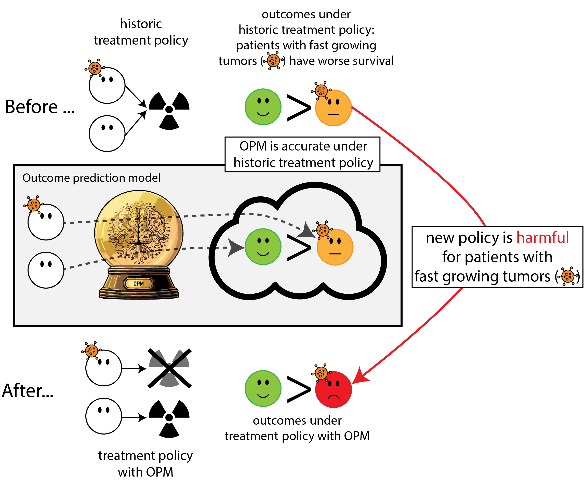
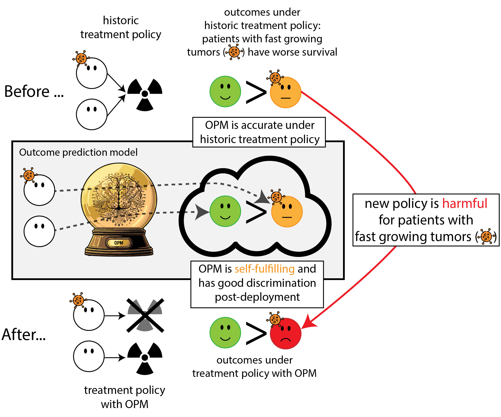
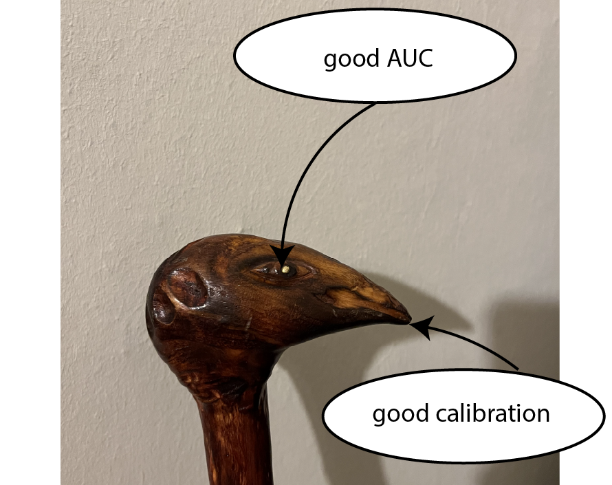
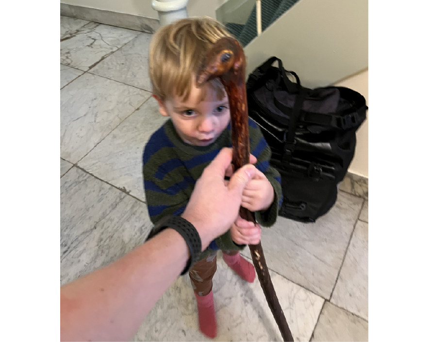
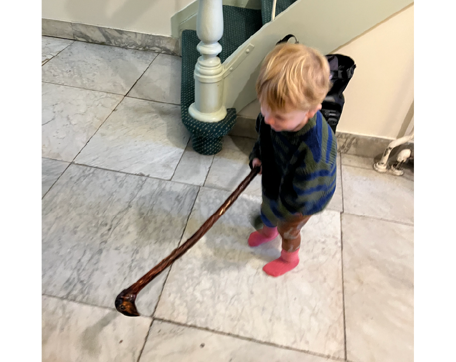
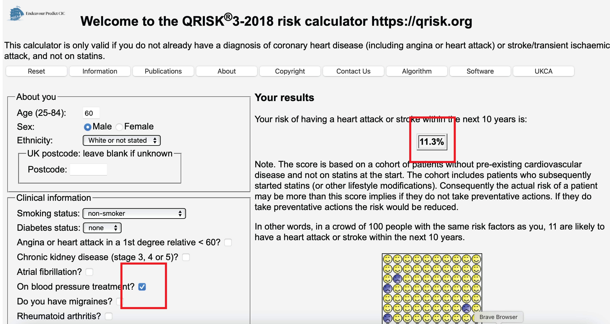

# Much of biostatistics, data-science and AI is 'predict, predict, predict!'

## Using medical information, predict 10-year heart attack risk

## from ECG, predict presence of heart failure (typically diagnosed with cardiac echo)

## Predictive performance measures

:::{.columns}

::::{.column width="50%"}

- sensitivity, specificity
- AUC
- accuracy
- calibration

::::

::::{.column width="50%"}

{.fragment}

::::

:::

<!-- ## Predictive model building entails modeling statistical associations in the 'healthcare system' -->
<!---->
<!-- {height=600 fig-align="center"} -->
<!---->
<!-- ## The goal is to deploy these models and have impact on healthcare, becoming part of the system -->
<!---->
<!-- {height=600 fig-align="center"} -->

## But prediction is hardly ever the end goal

instead, we want impact on healthcare through better decisions

## 10 year heart attack risk [@hippisley-coxDevelopmentValidationNew2024]

- prediction: heart attack in 10 years
- intervention: prescribe cholesterol lowering medication
- outcome: heart attack
- outcome (impact): reduce heart attacks

## Predict presence of heart failure from ECG [@yaoArtificialIntelligenceEnabled2021]

- prediction: heart failure
- intervention: refer patient for cardiac echo
- outcome: diagnosis of heart failure on echo
- outcome (impact): reduce preventable early cardiac death / morbidity

## Predictive performance vs impact

:::{.columns}

::::{.column width="50%" .nonincremental}

**predictive performance**

- sensitivity, specificity
- AUC
- accuracy
- calibration

::::

::::{.column width="50%"}

**healthcare impact**

- interventions (medical decisions)
- patient outcomes

::::

:::

- the hope is: better predictive performance $\implies$ better impact
- unfortunately, this is not automatically the case

# When accurate prediction models yield harmful self-fulfilling prophecies [@vanamsterdamWhenAccuratePrediction2025]

Wouter van Amsterdam, Nan van Geloven, Jesse Krijthe, Rajesh Ranganath, Giovanni Cina;
Patterns, 2025.

---

:::{.r-stack}

{.fragment height=22cm}

{.fragment height=22cm}

{.fragment height=22cm}

{.fragment height=22cm}

{.fragment height=22cm}

{.fragment height=22cm}

:::

## What happened here?

- had a 'good' model, got a bad policy
- model predicted outcome (survival) *under historic treatment policy* (always radiation)
- did not predict what outcomes would be under *alternative policy* (no radiation)
- in this case, unmodeled *treatment effect heterogeneity* (aka treatment effect modification, interation, differing conditional average treatment effects)

## Regulation to the rescue: we need to monitor (AI) models

:::{.r-stack}

{.fragment height=700px}

{.fragment}

:::

## Let's monitor the model performance over time 

:::{.r-stack}

{height=22cm}

{.fragment height=22cm}

:::

## What happened in monitoring?

- the model re-inforced its own predictions (self-fulfilling prophecy)
- took a measure of predictive performance (AUC)
- mistook it for a measure of (good) impact
- many potential examples (e.g. ICU stop treatment [@balcarcelFeedbackLoopsIntensive2025], others [@sciencemediacenterExpertReactionStudy])

---

:::{.r-stretch}

:::

<!-- ## Prediction model: walking stick -->
<!---->
<!-- ### Data Scientist are concerned with optimizing predictive performance -->
<!---->
<!-- :::{.r-stack} -->
<!---->
<!-- {.fragment height=18cm} -->
<!---->
<!-- {.fragment height=18cm} -->
<!---->
<!-- ::: -->
<!---->
<!-- ## Health care provider: stick user -->
<!---->
<!-- ### The healthcare provider uses the prediction model for decision making -->
<!---->
<!-- :::{.r-stack} -->
<!---->
<!-- {height=18cm} -->
<!---->
<!-- ::: -->
<!---->
<!-- ## Health care provider + stick = policy -->
<!---->
<!-- ### This combination leads to a new policy, which may yield unexpected results -->
<!---->
<!-- :::{.r-stack} -->
<!---->
<!-- {height=18cm} -->
<!---->
<!-- {.fragment height=18cm} -->
<!---->
<!-- ::: -->

# Second pitfall: confounding

---

---

## When selecting 'blood pressure medication', risk increases

- how is this possible?
- patients get blodo pressure medication because they are at higher risk of heart attack
- these reasons are not properly accounted for in the model, so the model learns that 'blood pressure medication' increases risk of a heart attack
- aka 'confounding by indication'
- should we stop prescribing blood pressure medications?

# Another way: prediction under intervention

## When predicting an outcome to support decisions regarding an intervention,

### this prediction needs a clear relationship with the targeted intervention [@vanamsterdamPrognosticModelsDecision2024]

::: {.callout-tip icon=false}
## Hilden and Habbema on prognosis [@hildenPrognosisMedicineAnalysis1987]

"Prognosis cannot be divorced from contemplated medical action, nor from action to be taken by the patient in response to prognostication.” 

:::

  - not: what's risk of heart attack given age and cholesterol,
  - but: what's risk of heart attack given age and cholesterol, **if we were not to give cholesterol lowering medication** [(vs. if we would)]{.fragment}
- may sound like $1+1=2$ but often not done; e.g. in the development data of Qrisk3, many patients already underwent cholesterol lowering medication [@peekHariSeldonQRISK32017]

## Prediction under hypothetical intervention incorporates effects of treatment in its predictions

- estimates the expected outcome $Y$ 
  - **if we were to give treatment $T$** to patient with features $X$
- a.k.a. 'counterfactual prediction'
- can  predict outcomes under multiple treatments, where one treatment may be 'no (additional) treatment / standard treatment'

## How to build prediction under intervention models?

- in its simplest form, can be just like fitting any other predictive model, as long as **causal identifyability assumptions** are fulfilled:
  - unconfoundedness (no hidden variables causing both the intervention and the outcome)
  - positivity, consistency
- these hold by design in Randomized Controlled Trials (RCT)
- RCTs are in that sense ideal [e.g. @kentPredictiveApproachesTreatment2020], but:
  - typically limited sample size
  - may not have measured right information (e.g. imaging markers, new biomarkers, full-EHR)
  - trial participants may not be representative of the target population of use [e.g. @lewisParticipationPatients652003]
- can *emulate* RCTs with non-experimental (*observational*) data using a causal inference framework, e.g. using target trial emulation

## Benefits of prediction under intervention

- policy rule: if expected outcome under treatment $A$ is better than under treatment $B$ (potentially by a certain margin), give treatment $A$, otherwise $B$
- as opposed to other prediction models, this policy has foreseable positive impact on health outcomes

---

## Benefits of prediction under intervention

:::{.nonincremental}

- policy rule: if expected outcome under treatment $A$ is better than under treatment $B$ (potentially by a certain margin), give treatment $A$, otherwise $B$
- as opposed to other prediction models, this policy has foreseable positive impact on health outcomes
- as a 'bonus', these models have stable calibration under shifts in policy that depend on the models' features [e.g. @fengMonitoringMachineLearningbased2024]

:::

## Measuring pre- and post-deployment

|               |                      | pre-deploy | deployment study | 
|---------------|----------------------|------------|------------------|
|               | **metric**           |            |                  |
| model         | discrimination (AUC) |   ✅       |                  |
|               | calibration          |   ✅       |                  |
| health system | interventions        |   ✅       |                  |
|               | patient outcomes     |   ✅       |                  |

**Legend**  
🔁 changes ✅ stable 🔻 worsens

## Measuring pre- and post-deployment 

|               |                      | pre-deploy | post-deploy |
|---------------|----------------------|------------|-------------|
|               | **metric**           |            |             |
| model         | discrimination (AUC) |   ✅       |       🔁    |
|               | calibration          |   ✅       |       🔻    |
| health system | interventions        |   ✅       |       🔁    |
|               | patient outcomes     |   ✅       |       🔁    |

**Legend**  
🔁 changes ✅ stable 🔻 worsens

- for 'non-causal' prognosis prediction models that don't factor in treatment decisions:
  - AUC will change, calibration will worsen as distribution changes
  - interventions and patient outcomes may change in unforeseen ways

## Measuring pre- and post-deployment 

|               |                      | pre-deploy | 'non-causal' | 'causal' |
|---------------|----------------------|------------|--------------|-------|
|               | **metric**           |            |              |       |
| model         | discrimination (AUC) |   ✅       |       🔁     |   🔁  |
|               | calibration          |   ✅       |       🔻     |   ✅  |
| health system | interventions        |   ✅       |       🔁     |   📈  |
|               | patient outcomes     |   ✅       |       🔁     |   📈  |

**Legend**  
🔁 changes ✅ stable 🔻 worsens 📈 changes in expected way

- for prediction under intervention model
  - calibration preserved under shifts in policy conditional on the model's features
  - interventions and outcomes change in foreseeable ways (under assumption on policy)

## Current status

- reporting guidelines (e.g. TRIPOD+AI [@collinsTRIPOD+AIStatementUpdated2024]) do not require a clear enoough description of relation between prediction and treatment [@PrognosticModelsDecision2024]
- some acceptance criteria lists (AJCC) even allow for harmful self-fulfilling prophecies [@kattanAmericanJointCommittee2016]
- EMA and FDA are developing monitoring guidelines, mostly emphasis on **predictive performance**, but **good performance** $\neq$ **postive impact**

## Takeaways

- when predicting prognosis, need well defined relation between prediction and potential treatment decisions
- in particular, *prediction under intervention* has the advantages of:
  1. clear relationship between model performance and value for decision making
  2. stable calibration under shifts in treatment policy, conditional on the model's features
- these models need unconfoundedness, so either
  - develop using RCT data
  - use observational causal inference
- evaluate and monitor prediction models based on what we care about: impact on healthcare

<!-- ## Violation of unconfoundedness: -->
<!---->
<!-- - Qrisk3 for predicting cardiovascular risk; risk increases when selecting 'patient uses blood pressure medication' -->

## References
