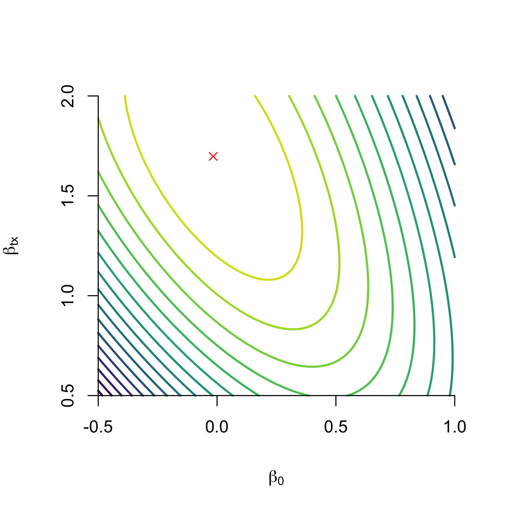
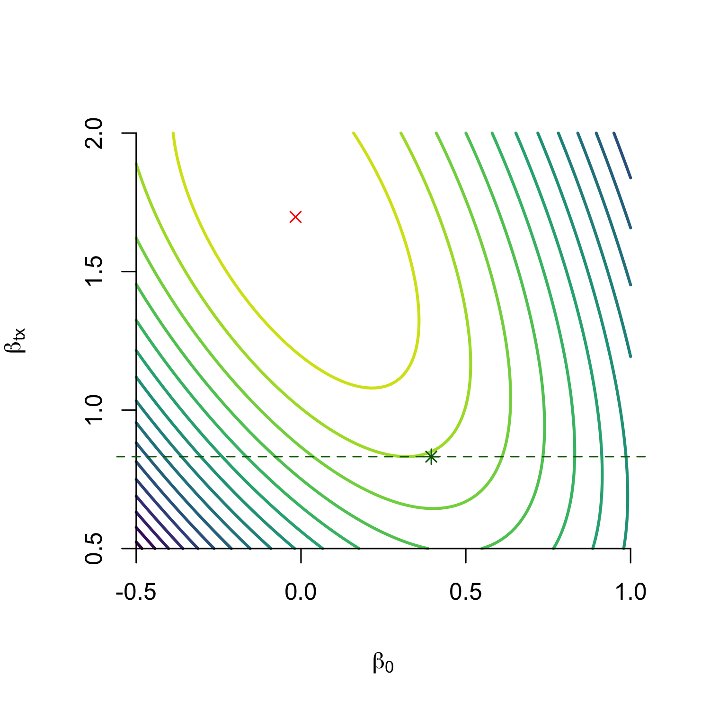
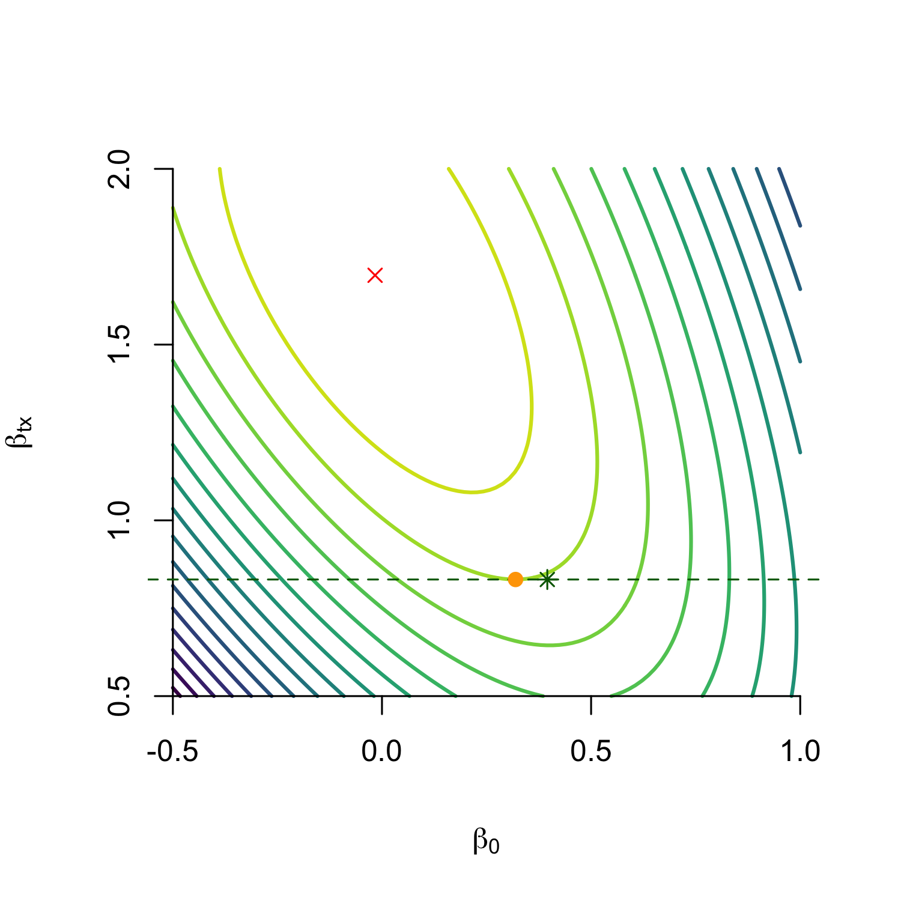
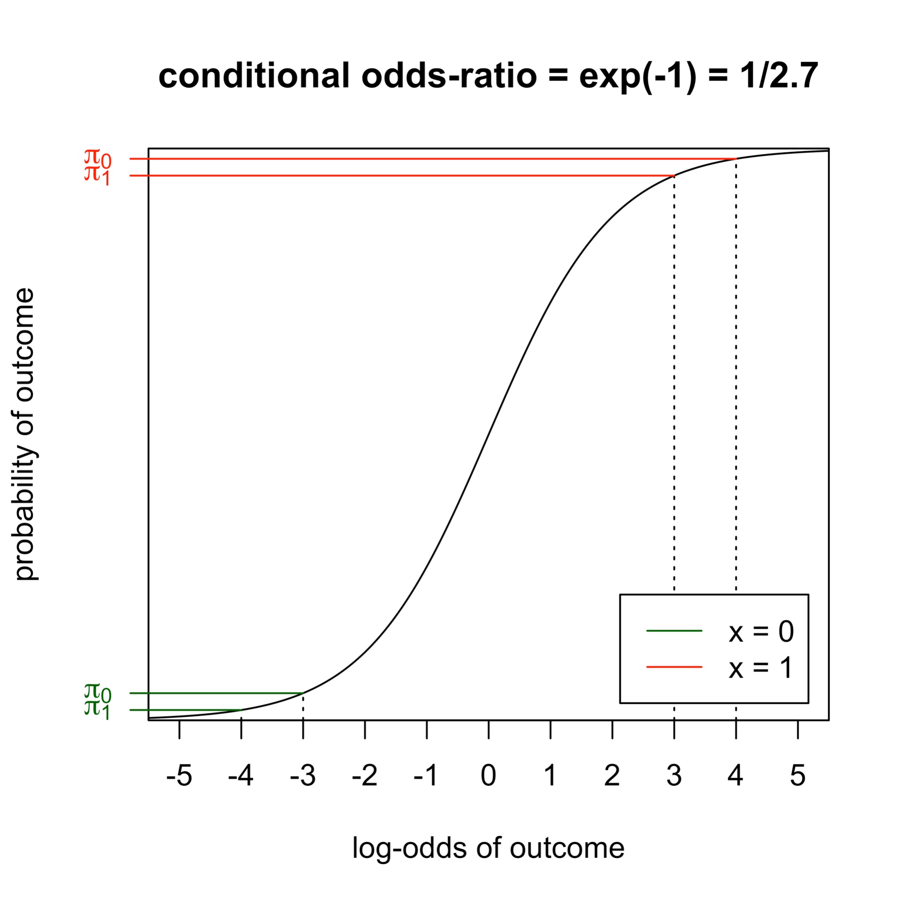
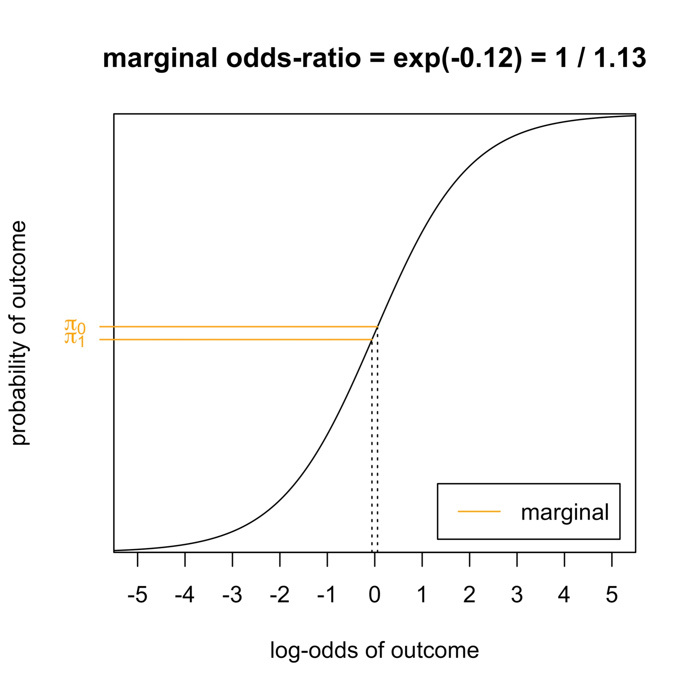
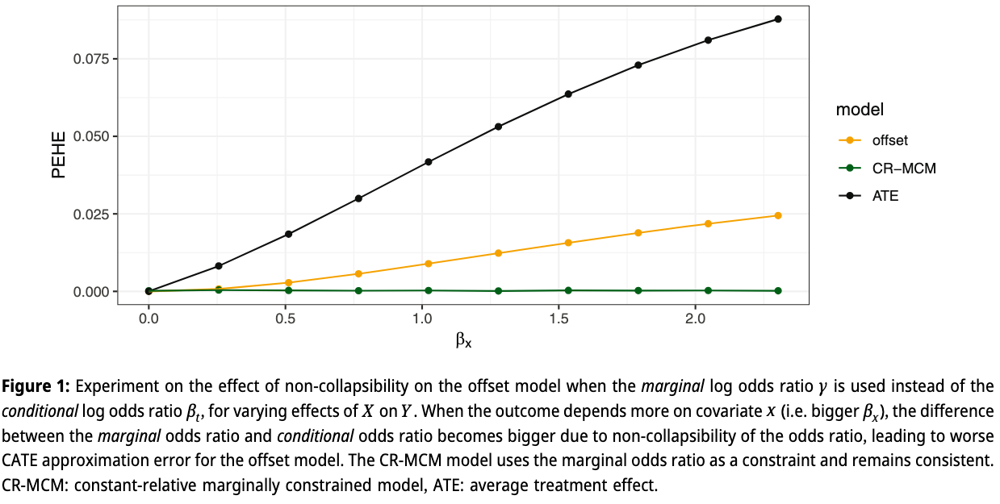
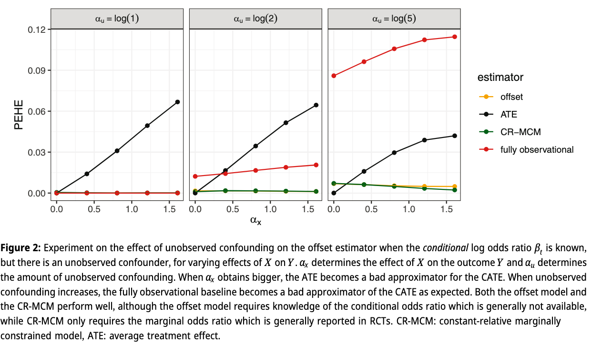
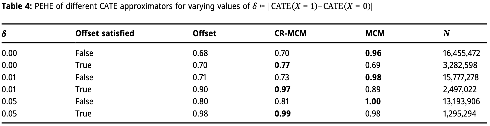

## Treatment decisions need individualized effects

- Treatment decisions compare two potential outcomes:
  $$Y_1 \quad \text{versus} \quad Y_0$$
- The clinically useful quantity is often the conditional average treatment effect:
  $$\tau(x) = E(Y_1 - Y_0 \mid X=x)$$

- Patients and care-givers prefer this to be on an absolute (probability) scale [@murrayPatientsInvestigatorsPrefer2018]
- Example: cardiovascular risk with or without cholesterol-lowering medication, given a patient's history.

## Why CATE estimation is hard

- Randomized controlled trials estimate average treatment effects.

. . .

$$\text{ATE} = E[\tau(x)]$$

- Estimating highly conditional effects in trials is expensive and often underpowered.
- Observational data are large and rich, but treatment assignment is confounded.

. . .

So the question is:

> Can we combine observational outcome models with treatment effects known from randomized trials?

## Effect measures matter

For binary outcomes, trials may report several valid causal summaries:

$$
\begin{aligned}
\text{risk difference} &= P(Y_1=1)-P(Y_0=1),\\
\text{risk ratio} &= \frac{P(Y_1=1)}{P(Y_0=1)},\\
\text{odds ratio} &= \frac{\text{odds}(Y_1=1)}
                         {\text{odds}(Y_0=1)}.
\end{aligned}
$$

. . .

(and their conditional variants)

## Relative treatment effects tend to be more stable

- Empirical observation: meta-analyses group together different trials with often (slightly) different underlying populations, from different centers etcetera
- Meta-analyses report a weighted average aggregated treatment effect, alongside an estimate of *residual heterogeneity* of treatment effects across studies (in random effects meta-analysis)
- When averaging effects, (odds and risk)-ratios tend to show lower heterogeneity $\rightarrow$ more stability across settings, are better **transportable** [@engelsHeterogeneityStatisticalSignificance2000]

. . . 

> Combining RCT data with observational data requires an assumption of *transportability*, we study transportability of the **odds-ratio**, assuming we know it from an external RCT

<!-- . . .

The choice is not cosmetic: it changes what "constant effect" means and which covariate distributions can be transported [@colnetRiskRatioOdds2023]. -->

## Constant relative effects still variable absolute effects

- If we assume a constant odds ratio for treatment
- If $\mathrm{OR}_T$ is constant, the absolute risk reduction ($\tau$) depends on *baseline* (untreated) risk.

::: {.fragment}
$$
E(Y_0\mid X=x) \quad \Longrightarrow \quad
\tau(x) = \text{odds}^{-1}(\text{OR}_T \text{odds}(Y_0 | X)) - E(Y_0\mid X=x)
$$
:::

- If we can estimate the untreated baseline risk conditional on $X$ from observational data, then we can derive the treated risk and the CATE.
- Unfortunately, estimating $E[Y_0|X]$ in general requires causal assumptions (unconfoundedness, positivity, consistency)

## Offset models

An offset model fixes the treatment coefficient to the value known from randomized evidence and estimates the remaining parameters from observational data.

For a logistic outcome model:

$$
\mathrm{logit}\{P(Y=1\mid X=x,T=t)\}
  = \beta_0 + \beta_x^\top x + \beta_t t.
$$

. . .

The usual offset approach plugs in $\beta_t=\log(\mathrm{OR}_T^{RCT})$.

## What the offset promises

- Use the rich covariates and large sample size of observational data.
- Avoid estimating the treatment effect from confounded treatment assignment.
- Produce baseline risk and treated risk from a single fitted model.
- Then derive CATEs under a constant relative treatment effect assumption.

. . .

This is already close to what some clinical prediction tools do in practice [@candidodosreisUpdatedPREDICTBreast2017, @ravdinComputerProgramAssist2001a, @alaaMachineLearningGuide2021], some of which are recommended for use by clinical guidelines [@cardosoEarlyBreastCancer2019]

## Unanswered question

- assume a model exists, such that
$$
\mathrm{logit}\{P(Y=1\mid X=x,T=t)\}
  = \beta_0 + \beta_x^\top x + \beta_t t.
$$

- and that $\beta_t$ is known from trials
- would we recover the correct $(\beta_0, \beta_x)$ by fitting an *offset model* on observational data?

## Without covariates, estimate $\beta_t, \beta_0$, but unobserved confounding exists

::: {.r-stack}
{.fragment .fade-out .current-visible height=580}
{.fragment height=580}
{.fragment height=580}
:::

:::{.fragment}

**We derive expression for gradient of log-likelihood for $\beta_0$ at ground truth and find its zero iff there is no unobserved confounding**

:::

## But CATEs require covariates

Once $X$ enters the model, two issues appear at the same time:

- confounding affects the observational likelihood;
- odds ratios are non-collapsible.

. . .

The second issue matters even without confounding.

## Non-collapsibility

::: {.columns}

::: {.column width="50%"}
{.img-large}
:::

::: {.column width="50%"}
{.img-large}
:::

:::

## Non-collapsibility creates a mismatch

- The odds ratio for treatment depends on whether we condition on $X$.
- This comes from the non-linearity of logistic regression.
- It also applies to hazard ratios.
- It gets stronger when $X$ is a stronger outcome predictor.

. . .

Conundrum:

- RCTs usually provide a marginal (log) odds ratio: $\log \gamma = \log \frac{\text{odds}(E[Y_1])}{\text{odds}(E[Y_0])}$

- The offset model needs a conditional odds ratio.
- The mismatch grows exactly when CATE variation becomes more useful.

## Fix: constrain the marginal odds ratio

Estimate all model parameters, including $\beta_t$, but force the fitted model to reproduce the randomized marginal treatment effect in the target population.

. . .

- From trial: $\gamma^* = \text{logit}(E[Y_1]) - \text{logit}(E[Y_0])$
- For candidate model with parameters $\theta$, compute:

. . . 

$$
\begin{aligned}
M_n(\theta)
&=\mathrm{logit}\left\{\frac{1}{n}\sum_{i=1}^{n}
P_\theta(Y=1\mid X=x_i,T=1)\right\} \\
&\quad-\mathrm{logit}\left\{\frac{1}{n}\sum_{i=1}^{n}
P_\theta(Y=1\mid X=x_i,T=0)\right\}.
\end{aligned}
$$

## Marginally constrained objective

Fit the observational outcome model subject to:

$$
M_n(\theta) = \hat\gamma_{RCT},
$$

where $\hat\gamma_{RCT}$ is the marginal log odds ratio reported by the trial.

. . .

Equivalently:

$$
\max_{\theta} \; \ell_{obs}(\theta)
\quad \text{subject to} \quad
M_n(\theta)-\hat\gamma_{RCT}=0.
$$

## Theorem 1

$$
\max_{\theta} \; \ell_{obs}(\theta)
\quad \text{subject to} \quad
M_n(\theta)-\hat\gamma_{RCT}=0.
$$

- We call such models **marginally constrained models** (MCM)
- When the model family assumes a constant relative treatment effect (here: $\text{logit}^{-1}(P(Y=1|T,X)) = \beta_0 + \beta_x + \beta_t t$), **constant relative MCM** *MCM-CR)
- (informal) under consistency, positivity and unconfoundedness and correct model specification, this is a consistent estimator of $P(Y_t=1|X)$ and thus $\tau(x)$

## Intuition

The model can learn the conditional treatment coefficient that best explains the observational outcomes.

. . .

But it is only allowed to do so if the implied randomized experiment in the current population agrees with the trial evidence.

. . . 

Why constrain the odds-ratio? Need a measure that is likely to be *transportable* between settings

## How the constraint was implemented in the paper

The paper used an increasingly strong quadratic penalty:

$$
\ell_{obs}(\theta) -
\lambda\{M_n(\theta)-\hat\gamma_{RCT}\}^2.
$$

. . .

Algorithm:

- start with a small $\lambda = 0.01$;
- optimize the unconstrained penalized objective with L-BFGS;
- check whether the constraint error is below $10^{-4}$;
- multiply $\lambda$ by 10 and repeat until satisfied.

. . .

This treats the trial estimate as effectively exact once the penalty becomes strong.

## How much would all this matter in practice?

- aim was to estimate $\tau(x)$
- metric is mean squared error of $\tau(x)$ (precision of estimated heterogeneous treatment effect):

. . . 

$$\text{PEHE}(\hat{\tau}) = E_x [(\tau(x) - \hat{\tau(x)})^2]$$

- Remember we started with saying $\text{ATE} = E[\tau(x)]$ can be a bad estimator of CATE.
- Easy to see that:

. . .

$$\text{PEHE}(\text{ATE}) = \text{Var}(\text{CATE})$$

- If no variance in CATE, ATE is the optimal estimator
- Mabye offset models are not 'correct', are they better than ATE?

## Result: PEHE under increasing non-collapsibility?

{.full-figure}

## Result: when correct $\beta_t$ is known but unobserved confounding

{.full-figure}

## Bigger experiment

- $X,T,U,Y$ binary
- $T \sim p(T|U)$
- $Y \sim p(Y|T,X,U) = \text{logit}^{-1}(\alpha_0 + \alpha_x x + \alpha_t t + \alpha_u u)$
- 12 dimensions, $\geq 16*10^6$ experiments
- compare *offset*, *MCM*, *MCM-CR*

## What's the baseline?

- when $\text{Var}(\text{CATE}) = 0, \text{PEHE}(\text{ATE}) = 0$
- Consider as measure of how much PEHE can be gained:

. . .

$$\delta := | \text{CATE}(X=1) - \text{CATE}(X=0) | $$

- then when $P(X=1) = 0.5$:

. . .

$$\text{Var}(\text{CATE}) = 0.25 \delta^2$$

## Table 1: number of times method improves upon ATE in terms of PEHE

- when more variance in CATE, all methods perform better
- MCM performs best
- when offest (constant-relative) assumption holds, those methods work better
- standard offset often better under non-zero variance in CATE

## Caveats

- compare on single metric across huge range of settings
- average performance, no gaurantee on single setting

## Limitations and future work

- assumed direct transportability of marginal odds ratio
- in calculation of implied marginal odds-ratio, used unweighted sample average, could replace with importance weights based on $X$ if known between trial and observational data if they have different covariate distributions
- we (silently) assumed knowing the marginal odds-ratio with infinete precision and no bias
  - unpublished experiments show MCM rapidly worse than 'fully observational' when variance of RCT estimate (wrong constraint)
- better would be to consider uncertainty, e.g. as 'Bayesian prior':

. . .

$$
\ell_{obs}(\theta)
-
\frac{1}{2}
\left(
\frac{M_n(\theta)-\hat\gamma_{RCT}}
     {\mathrm{SE}(\hat\gamma_{RCT})}
\right)^2.
$$

## Extensions

- are there better measures of effect to assume are constant? (e.g. risk ratio or survival ratio [@colnetRiskRatioOdds2023])
- extend to Hazard Ratios (calculating constraint requires an optimization)
- what happens with higher dimensional $X$?

## Take-home

- Offset models ask a reasonable clinical question: can trial relative effects turn prediction models into CATE models?
- The naive offset has two problems: confounding and marginal-versus-conditional effect mismatch.
- MCM uses the trial result as a marginal constraint, which is the scale on which trials often report evidence.
- The next estimator should treat the trial estimate as uncertain evidence, not an exact equality.

## References {.smaller}
