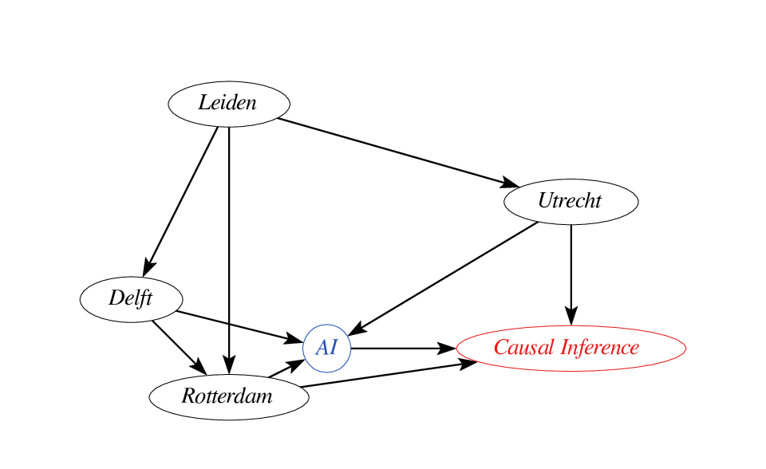

Causal Inference for AI meetup
Utrecht, October 5, 2026

## Today's program

- Isak Åslund (LUMC): *“Evaluation Metrics for Predictions of Conditional Average Treatment Effects“*
- Colleen Reynolds (Erasmus MC): *"A Causal Approach to Describing Disparities Across Post-Intervention Variables"*
- Henri Arno (Ghent University): *"Rank-Learner: Orthogonal Ranking of Treatment Effects”*
- 17.00 'borrel'

## Next Meet-ups

- Leiden: Monday, November 30th, 2026
- Rotterdam: Monday, March 8, 2027
- Delft: Monday, May 31, 2027
